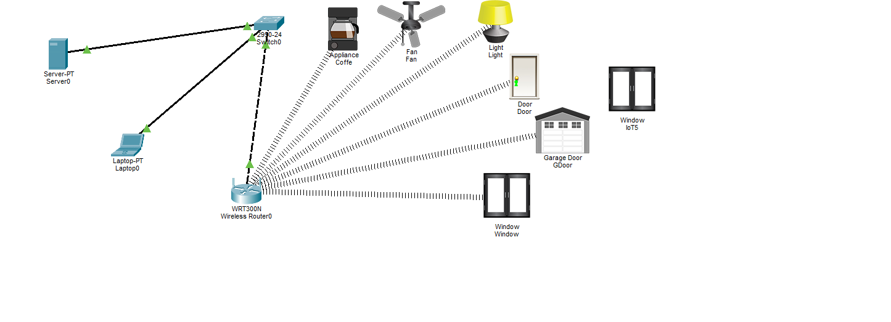
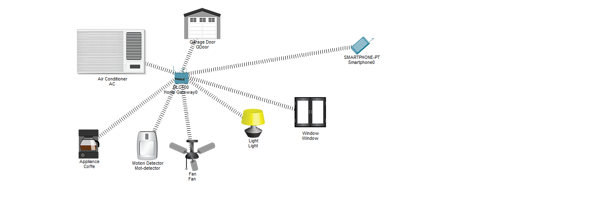

# 🏠 Smart Home IoT Configurations (Cisco Packet Tracer)

يقدم هذا المستودع تصميمين مختلفين لشبكات المنزل الذكي (Smart Home) باستخدام برنامج **Cisco Packet Tracer**، يوضحان الفرق بين إدارة الأجهزة عبر خادم مخصص (Server-Based) وبين الأتمتة المباشرة عبر البوابة المنزلية (Home Gateway).

---

## 🛠️ تفاصيل المشاريع والطرق المستخدمة

### 1️⃣ Smart Home using IoT Server (`smart-home-server.pkt`)
* **المعمارية:** شبكة مركزية تعتمد على **IoT Registration Server**.
* **طريقة الربط:** تتصل الأجهزة الذكية لاسلكياً بـ Wireless Router موصل عبر Switch بخادم مخصص (`Server0`).
* **التحكم:** تسجيل وإدارة جميع الأجهزة عبر السيرفر، مع إمكانية الدخول لشاشة التحكم من الـ Laptop أو المتصفح.

---

### 2️⃣ Smart Home using Home Gateway & Motion Automation (`smart-home-gateway.pkt`)
* **المعمارية:** شبكة منزلية مباشرة تعتمد على **Home Gateway** بدون الحاجة لسيرفر خارجي.
* **الأتمتة والقواعد الشرطية (IoT Conditions):**
  تم إعداد قواعد أتمتة تفاعلية تعتمد على **مستشعر الحركة (Motion Detector)**:
  * 🚶‍♂️ **عند اكتشاف حركة:**
    * تشغيل **المكيف (Air Conditioner)** تلقائياً.
    * فتح **باب الكراج (Garage Door)**.
    * تشغيل **المروحة (Fan)**.
    * إضاءة **اللمبة (Light)**.
* **التحكم:** التحكم المباشر ومراقبة حالة الأجهزة من خلال تطبيق **IoT Monitor** على الهاتف الذكي (`Smartphone0`).

---

## 📂 جدول ملفات المستودع

| اسم الملف | المعمارية | المكونات والأتمتة الرئيسية |
| :--- | :--- | :--- |
| `smart-home-server.pkt` | **Server-Based** | Server, Switch, Wireless Router, Laptop, Smart Devices |
| `smart-home-gateway.pkt` | **Home Gateway** | Home Gateway, Motion Sensor, Smartphone, Automated AC/Garage/Fan/Light |

---

## 🚀 كيفية التشغيل والملاحظات
1. افتحي الملفات باستخدام برنامج **Cisco Packet Tracer**.
2. **في مشروع السيرفر:** افتحي المتصفح في جهاز الـ Laptop وسجلي الدخول لعرض قائمة الأجهزة المتصلة بـ Server0.
3. **في مشروع البوابة المنزلية:** اختبري تحريك العنصر أمام **Motion Detector** لملاحظة استجابة المكيف، المروحة، اللمبة وباب الكراج تلقائياً.
